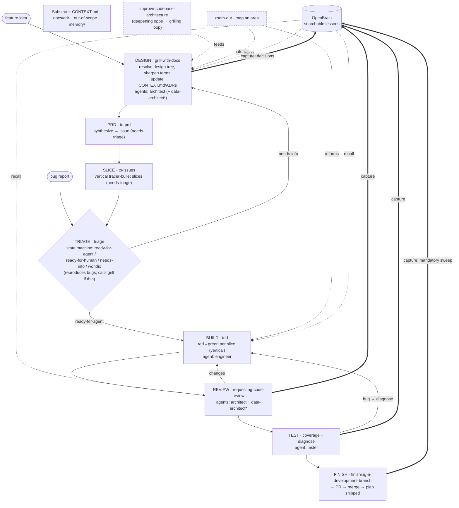

# Dev Workflow Redesign — Skeleton (DRAFT, grounded)

Three pillars:
1. **Spine** = Matt Pocock's engineering skills, composed per their *actual* definitions + cross-references.
2. **Agents** = `architect`, `data-architect`, `engineer`, `tester` engaged at design / build / review / test.
3. **OpenBrain** = searchable lessons: **read** going into grill/build/review, **written** coming out of grill/review/test/finish.

---

## The substrate (read by every skill; written by grill + improve-arch)

```
CONTEXT.md (domain glossary)  ·  docs/adr/  ·  .out-of-scope/   ← living docs
OpenBrain (searchable lessons)  ·  memory/ (always-on curated)  ← lessons
```
Every Pocock skill reads the glossary + respects ADRs. `grill-with-docs` and `improve-codebase-architecture` update `CONTEXT.md`/ADRs **inline** as decisions crystallize.

---

## The flow (rendered diagram)



`*` data-architect engaged only when the data model is touched.

---

## The Durability Gate (the non-negotiable constraint)

A hard gate at **DESIGN→PRD**, **REVIEW sign-off**, **and the FIX step of `diagnose`**. The AI's default failure mode is taking the easy way out — least-effort design/build *and especially least-effort bug fixes* (symptom-patch, band-aid the call site, fix a path slated for deletion) — which ships technical debt. This gate counters it. A spec, slice, **or fix** that fails any check is **rejected and redesigned, never shipped "for now."** And the workflow **never even surfaces** an option that violates these (no minimal-diff A/B forks).

> **Fixes are gated too.** `diagnose` already drives to the **root cause** (reproduce → hypothesise → instrument); the gate then requires the **fix** to be durable — at the right seam, deep-module-shaped, data-model-sound — not a symptom patch. The architect (+ data-architect for data) reviews fixes that touch a seam or the schema, same as features.

| # | Check | Enforced by | Grounded in |
|---|-------|-------------|-------------|
| 1 | **Durable / lasting** — solves the real problem at the right seam, not a band-aid that resurfaces | architect | `feedback_target_state_over_minimal_diff` |
| 2 | **Fits the target architecture** — names the `docs/target-architecture.md` seam it lands at; no adding to a fold-slated file; no shallow-module drift | architect | CLAUDE.md plan-grounding rule |
| 3 | **Deep modules** — small interface, deep implementation; passes the deletion test; the interface is the test surface | architect | `improve-codebase-architecture` |
| 4 | **Scalable + performant data model** — additive migrations, indexes, pagination on wide reads, server-side counters, no shape drift, no N+1 | data-architect | the OpenBrain outage/bug classes |

> These four are exactly where the worst OpenBrain lessons came from (half-shipped migrations, RLS wipes, 1000-row truncation, JS-side counters) — so the gate is enforced by the same architect + data-architect review that already exists, now with explicit pass/fail criteria.

---

## OpenBrain wiring — recall by issue-class, capture by routing rule

**Recall (read) — target the classes that actually bite:**

| Phase | Tool | Query / filter |
|---|---|---|
| 0 Context | `get_repo_profile` + `match_deployment_lessons` | the area being entered |
| 1 Design (grill) | `match_deployment_lessons` (`eval_type=pre_deploy`/`invariant`) | the feature/schema → surfaces migration · RLS · grant · additive landmines |
| 4 Build (tdd) | `match_deployment_lessons` | files/modules → pagination · counters · destructive-op watch-outs |
| 5 Review | `search_deployment_lessons` (`category`, `severity=bug`) | "bugs we've hit here" checklist |

**Capture (write) — route by always-on vs area-specific:**

| What kind of lesson | Where | Why |
|---|---|---|
| Always-on **methodology** (data-exists≠renders, fold-vs-redesign, spec-grounding, post-PR-verify) | **both** file-`memory/feedback_*` **and** OpenBrain | file-memory = in every session; OpenBrain = surfaces on semantic match |
| Area-specific **ops** (RLS folding, pagination, grants, migration mechanics) | **OpenBrain** `deployment_lesson` only (with `guardrail`) | searchable when working that area; would bloat always-on context |
| Soft / uncertain | `add_thought` → `promote_thought_to_lesson` when it proves durable | dedup + promote later |

Capture points: **Design** (decisions→ADRs, insight→thought) · **Review** (`add_deployment_lesson`+guardrail) · **Test/diagnose** (`add_deployment_lesson` severity=bug, guardrail = the regression test) · **Finish** (mandatory sweep, routed per the table).

The **Finish gate** encodes the PR-1 outage lesson directly: plan-vs-actual diff + live-DB completeness query before "done."

---

## Skill roster — every Matt skill, placed

| Matt skill | Grounded role | Phase | Agent(s) | OpenBrain | Writes |
|---|---|---|---|---|---|
| `grill-with-docs` | relentless 1-at-a-time interview; resolve design tree; sharpen terms | **DESIGN** (also *inside* triage & improve-arch) | architect (+ data-architect\*) | recall→seed Q's · capture→decisions | CONTEXT.md, ADRs |
| `to-prd` | synthesize known understanding → PRD issue (no interview) | **PRD** | — (user checks modules) | — | issue tracker |
| `to-issues` | break PRD → vertical tracer-bullet slices (HITL/AFK) | **SLICE** | — | — | issue tracker |
| `triage` | issue state machine; reproduce bugs; call grill if thin | **TRIAGE** (hub/gate) | — (maintainer-driven) | recall `.out-of-scope` + lessons | `.out-of-scope/`, labels |
| `tdd` | red→green **vertical** slices through public interfaces | **BUILD** | engineer | recall file/area lessons | — |
| `diagnose` | build feedback loop → reproduce → hypothesise → fix → regress | **TEST/BUILD** (bugs) | tester / engineer | recall bug-class · capture | — |
| `improve-codebase-architecture` | find shallow→deep deepening opps; grilling loop | cross-cutting (feeds DESIGN) | architect | recall · capture | CONTEXT.md, ADRs |
| `zoom-out` | map a code area at higher abstraction (manual only) | cross-cutting (navigation) | — | — | — |

(`setup-matt-pocock-skills` = one-time per-repo config: issue tracker, label vocabulary, doc locations.)

---

## One-liner

> Pocock skills are the **verbs**; the four agents are the **brains** at design/build/review/test; `triage` is the **gate** issues pass through; OpenBrain is **read going in** and **written coming out** of each phase; `CONTEXT.md`+ADRs are the **shared language** every skill speaks.
