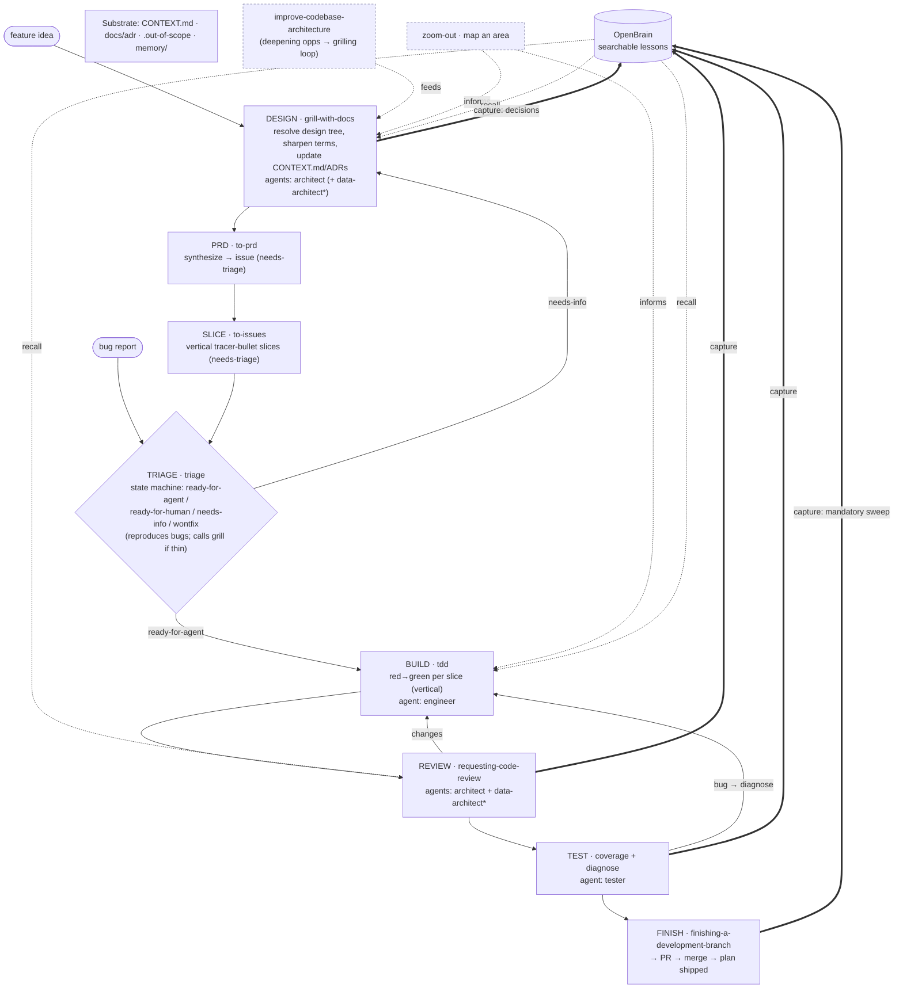

# Dev workflow — the development loop

This is the canonical reference for how a feature or a bug moves from idea to merged
code in this repo. The agent preambles (`.claude/agents/*.md`) refer to this doc by
name; the Durability Gate and the phase-transition footer are defined here.

The design rationale (why this shape, why composable-not-monolithic) lives in
`docs/plans/2026-06-03-dev-workflow-redesign-design.md`. **This doc is the operational
reality**: which skill at which phase, which agent, what the gate checks, what to recall
and capture.

## Three pillars

1. **Spine** = Matt Pocock's composable engineering skills, used per their actual
   definitions and cross-references — `grill-with-docs → to-prd → to-issues → triage →
   tdd → diagnose`. Deliberately **not** a monolithic orchestrator: nothing auto-advances,
   you stay in control of when to move to the next phase. The skills live in
   `~/.claude/vendor/mattpocock-skills/skills/engineering/` and are available as Skill-tool
   skills.
2. **Agents** = the four generic dev agents — `architect`, `data-architect`, `engineer`
   (`developer`), `tester` — engaged at design / build / review / test.
3. **OpenBrain** = searchable lessons: **recalled** going into grill / build / review,
   **captured** coming out of grill / review / test / finish.

## The substrate (read by every skill; written by grill + improve-arch)

```
CONTEXT.md (domain glossary)  ·  docs/adr/  ·  .out-of-scope/*   ← living docs
OpenBrain (searchable lessons)  ·  memory/ (always-on curated)  ← lessons
```

Every Pocock skill reads the glossary + respects the ADRs. `grill-with-docs` and
`improve-codebase-architecture` update `CONTEXT.md` / ADRs **inline** as decisions
crystallize. `.out-of-scope/` is created on demand by `triage` when an idea is parked,
and recalled by `triage` so the same idea isn't re-litigated.

## The flow



`*` data-architect engaged only when the data model is touched.

## The Durability Gate (the non-negotiable constraint)

A hard gate at **DESIGN→PRD**, **REVIEW sign-off**, **and the FIX step of `diagnose`**.
The AI's default failure mode is taking the easy way out — least-effort design / build
*and especially least-effort bug fixes* (symptom-patch, band-aid the call site, fix a
path slated for deletion) — which ships technical debt. This gate counters it. A spec,
slice, **or fix** that fails any check is **rejected and redesigned, never shipped "for
now."** And the workflow **never even surfaces** an option that violates these (no
minimal-diff A/B forks).

> **Fixes are gated too.** `diagnose` already drives to the **root cause** (reproduce →
> hypothesise → instrument); the gate then requires the **fix** to be durable — at the
> right seam, deep-module-shaped, data-model-sound — not a symptom patch. The architect
> (+ data-architect for data) reviews fixes that touch a seam or the schema, same as
> features.

| # | Check | Enforced by | Grounded in |
|---|-------|-------------|-------------|
| 1 | **Durable / lasting** — solves the real problem at the right seam, not a band-aid that resurfaces | architect | `feedback_target_state_over_minimal_diff` |
| 2 | **Fits the target architecture** — names the `docs/target-architecture.md` seam it lands at; no adding to a fold-slated file; no shallow-module drift | architect | CLAUDE.md plan-grounding rule |
| 3 | **Deep modules** — small interface, deep implementation; passes the deletion test; the interface is the test surface | architect | `improve-codebase-architecture` |
| 4 | **Scalable + performant data model** — additive migrations, indexes, pagination on wide reads, server-side counters, no shape drift, no N+1 | data-architect | the OpenBrain outage/bug classes |

> These four are exactly where the worst OpenBrain lessons came from (half-shipped
> migrations, RLS wipes, 1000-row truncation, JS-side counters) — so the gate is enforced
> by the same architect + data-architect review that already exists, now with explicit
> pass/fail criteria.

The gate block lives verbatim, as its own `## Durability Gate` section, in
`.claude/agents/architect.md` and `.claude/agents/data-architect.md` (the two enforcers).
The `engineer` (`developer`) and `tester` preambles reference it: it governs the code
that gets built and any fix that gets shipped.

## OpenBrain wiring — recall by issue-class, capture by routing rule

> The recall/capture **mechanics** — the exact tool calls, the valid parameter values, and
> the capture routing — live in one canonical reference:
> **`docs/process/openbrain-recall-capture.md`**. The four dev agents are granted the
> recall + capture MCP tools in their `tools:` frontmatter and point at that doc, so the
> convention is one shared path, not ad-hoc per caller (slice #138). The tables below are
> the loop-level summary.

**Recall (read) — target the classes that actually bite:**

| Phase | Tool | Query / filter |
|---|---|---|
| 0 Context | `get_repo_profile` + `match_deployment_lessons` | the area being entered |
| 1 Design (grill) | `match_deployment_lessons` (`eval_type=pre_deploy`/`invariant`) | the feature/schema → surfaces migration · RLS · grant · additive landmines |
| 4 Build (tdd) | `match_deployment_lessons` | files/modules → pagination · counters · destructive-op watch-outs |
| 5 Review | `search_deployment_lessons` (`category`, `severity=bug`) | "bugs we've hit here" checklist |

**Capture (write) — route by always-on vs area-specific:**

| What kind of lesson | Where | Why |
|---|---|---|
| Always-on **methodology** (data-exists≠renders, fold-vs-redesign, spec-grounding, post-PR-verify) | **both** file-`memory/feedback_*` **and** OpenBrain | file-memory = in every session; OpenBrain = surfaces on semantic match |
| Area-specific **ops** (RLS folding, pagination, grants, migration mechanics) | **OpenBrain** `deployment_lesson` only (with `guardrail`) | searchable when working that area; would bloat always-on context |
| Soft / uncertain | `add_thought` → `promote_thought_to_lesson` when it proves durable | dedup + promote later |

Capture points: **Design** (decisions→ADRs, insight→thought) · **Review**
(`add_deployment_lesson`+guardrail) · **Test/diagnose** (`add_deployment_lesson`
severity=bug, guardrail = the regression test) · **Finish** (mandatory sweep, routed per
the table).

### The Finish gate (enforced)

The Finish phase is **enforced**, not hoped for — `evals/finish-gate-check.sh`, wired into
`.husky/pre-push`, blocks the push (and therefore the PR) unless:

1. **A lesson was captured for the branch** — a `Dev-Workflow-Lesson: <id|none>` commit
   trailer (use `none` to explicitly mark "nothing worth keeping").
2. **For data-model work** (the branch touches `scripts/migration.sql`) **the PR-1
   verification was asserted** — a `Dev-Workflow-DB-Verified: <evidence>` trailer. This
   encodes the PR-1 outage lesson directly: plan-vs-actual diff (`git show --stat`
   cross-checked to the plan) + a live-DB completeness query (`make check-supabase-deep` +
   the plan's invariant count, expect 0) before "done." The hook *asserts the verification
   ran*; it cannot know each plan's invariants and CI cannot reach the homelab DB, so the
   evidence is a trailer, not a query the hook runs itself.

Non-data-model branches need only the lesson trailer (not over-gated). WIP / intermediate
pushes bypass with `SKIP_FINISH_GATE=1 git push`, matching the `ALLOW_*_COMMIT` escape
idiom in `.husky/pre-commit`.

```
git commit --amend --trailer "Dev-Workflow-Lesson: <openbrain-id|none>"
git commit --amend --trailer "Dev-Workflow-DB-Verified: $(date +%F) <evidence>"   # schema branches
```

## Phase-transition guidance (the navigational glue)

Because the workflow is **composable, not a monolith** (nothing auto-advances), each
phase **ends by suggesting the next** — this is what keeps you guided through the loop
while *you* stay in control of when to advance. It's the glue that replaces the
process-owner we deliberately rejected.

Every agent and skill closes with a standard footer:

> ✅ **\<phase\> complete.** Next → **\<next phase\>**: run `\<skill\>` (agent: \<X\>;
> recall: \<query\>; the Durability Gate applies). *Or:* changes/bug → back to BUILD via
> `diagnose`.

The transition map:

| Just finished | Suggest next | Run | Note |
|---|---|---|---|
| DESIGN (`grill-with-docs`) | PRD | `to-prd` | gate must have passed |
| PRD (`to-prd`) | SLICE | `to-issues` | issue is `needs-triage` |
| SLICE (`to-issues`) | TRIAGE | `triage` | → `ready-for-agent` |
| TRIAGE | BUILD | `tdd` (engineer) | only `ready-for-agent` slices |
| BUILD (`tdd`) | REVIEW | `requesting-code-review` (architect + data-architect\*) | |
| REVIEW | TEST | coverage (tester) | changes → back to BUILD |
| TEST | FINISH | `finishing-a-development-branch` | bug → `diagnose` → BUILD |
| FINISH | (next slice / queue) | `triage` "what's ready" | after the capture sweep |

This footer is baked into the **agent preambles** and surfaced by the thin
**`/forge-id`** launcher (`.claude/skills/forge-id/SKILL.md`) — phase-0 context-load +
"you are here → next". The launcher orients and hands off; it deliberately does **not**
drive phases (no monolithic orchestrator).

## Skill roster — every Matt skill, placed

| Matt skill | Grounded role | Phase | Agent(s) | OpenBrain | Writes |
|---|---|---|---|---|---|
| `grill-with-docs` | relentless 1-at-a-time interview; resolve design tree; sharpen terms | **DESIGN** (also *inside* triage & improve-arch) | architect (+ data-architect\*) | recall→seed Q's · capture→decisions | CONTEXT.md, ADRs |
| `to-prd` | synthesize known understanding → PRD issue (no interview) | **PRD** | — (user checks modules) | — | issue tracker |
| `to-issues` | break PRD → vertical tracer-bullet slices (HITL/AFK) | **SLICE** | — | — | issue tracker |
| `triage` | issue state machine; reproduce bugs; call grill if thin | **TRIAGE** (hub/gate) | — (maintainer-driven) | recall `.out-of-scope` + lessons | `.out-of-scope/`, labels |
| `tdd` | red→green **vertical** slices through public interfaces | **BUILD** | engineer | recall file/area lessons | — |
| `diagnose` | build feedback loop → reproduce → hypothesise → fix → regress | **TEST/BUILD** (bugs) | tester / engineer | recall bug-class · capture | — |
| `improve-codebase-architecture` | find shallow→deep deepening opps; grilling loop | cross-cutting (feeds DESIGN) | architect | recall · capture | CONTEXT.md, ADRs |
| `zoom-out` | map a code area at higher abstraction (manual only) | cross-cutting (navigation) | — | — | — |

## One-liner

> Pocock skills are the **verbs**; the four agents are the **brains** at
> design/build/review/test; `triage` is the **gate** issues pass through; OpenBrain is
> **read going in** and **written coming out** of each phase; `CONTEXT.md`+ADRs are the
> **shared language** every skill speaks; the **Durability Gate** is the bar every spec,
> slice, and fix must clear.
